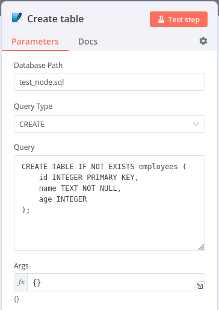
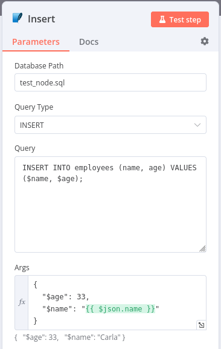
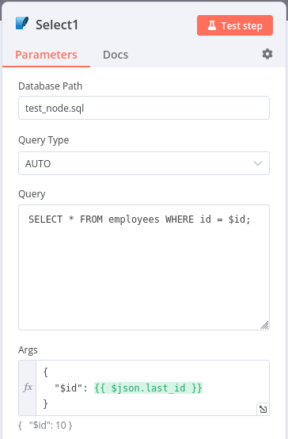
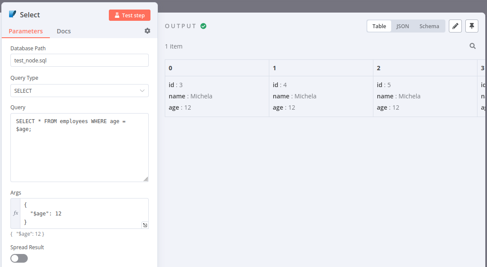
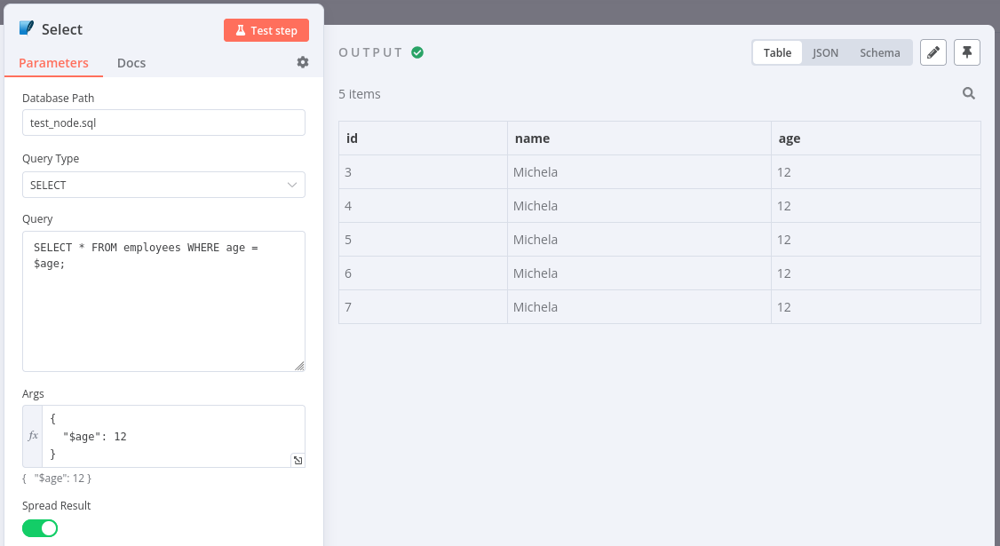

# n8n-nodes-sqlite3

This is an n8n community node. It lets you use SQLite3 in your n8n workflows.

SQLite3 is a lightweight, self-contained SQL database engine that stores all data in a single file and requires no server setup. It is ideal for embedded applications, local storage, and small to medium-sized projects. As a public-domain software, it is free for use in both personal and commercial applications.

[n8n](https://n8n.io/) is a [fair-code licensed](https://docs.n8n.io/reference/license/) workflow automation platform.

## Installation

Follow the [installation guide](https://docs.n8n.io/integrations/community-nodes/installation/) in the n8n community nodes documentation.

To use this node in your n8n instance:

1. Clone or download the repository containing this node.
2. Copy the node files into the appropriate directory in your n8n installation. `~/.n8n/custom`
3. Restart your n8n instance to load the new node.

In order to build

npm run build
npm link

## Operations

- **Flexible Query Execution**: Supports multiple SQL operations (`SELECT`, `INSERT`, `UPDATE`, `DELETE`, `CREATE`) to manage your database.
- **Dynamic Query Type Detection**: Automatically detects the query type if not explicitly specified.
- **Parameterized Queries**: Pass dynamic parameters to your queries for secure and efficient database operations.
- **Spread Results Option**: Option to spread the result of a `SELECT` query into multiple items for further processing in n8n.
- **Error Handling**: Built-in error handling that allows you to continue workflow execution even if an error occurs.

## Compatibility

This node is compatible with all n8n versions that support custom nodes. Ensure your n8n instance is up to date to take advantage of the latest features and bug fixes.

## Usage

1. **Add the SQLite Node**: Drag and drop the SQLite Node into your n8n workflow.
2. **Configure Database Path**: Set the path to your SQLite database file.
3. **Choose Query Type**: Select a query type or leave it as `AUTO` to detect automatically.
4. **Write Your Query**: Enter the SQL query you want to execute.
5. **Provide Arguments (Optional)**: If your query uses parameters, provide them in JSON format.
6. **Spread Result (Optional)**: Enable this option if you want each row of a `SELECT` query to be outputted as a separate item.
7. **Execute the Workflow**: Run your workflow to perform the desired SQL operation.

### Create table

Args are not needed for creating a table simply past the query.

### Insert

It's important to specify parameter in this syntax `$param`.
This prevent sql-injection and it's easy to debug an error.

### Auto

Auto select is a very powerful resource, check if the query contains one of the default instruction and use that.
This example use the `SELECT` operation.

### Spread select results

Normally nodes return 1 value for each items passed.

With spread operator only available for `SELECT` it's possible to return multiple items for every item requested.

## Resources

- [n8n Documentation](https://docs.n8n.io/)
- [SQLite Documentation](https://www.sqlite.org/docs.html)
- [n8n Documentation](https://docs.n8n.io/integrations/creating-nodes/build/declarative-style-node/#step-35-add-operations)
- [medium article](https://medium.com/@tarikalaouimhamdi/how-to-create-your-own-n8n-node-package-f298675712f0)
- [SQLite3 package](https://www.npmjs.com/package/sqlite3)
- [sqlite3 wiki](https://github.com/TryGhost/node-sqlite3/wiki/API)
- [n8n Documentations UI](https://docs.n8n.io/integrations/creating-nodes/build/reference/ui-elements/#string)

## Contributing

Contributions are welcome! If you have any feature requests, bug reports, or suggestions, feel free to open an issue or submit a pull request.

---

Start integrating SQLite3 into your n8n workflows today with this community node! 🛠️🚀
