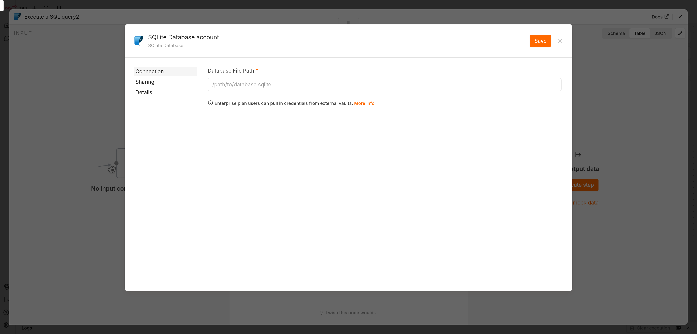
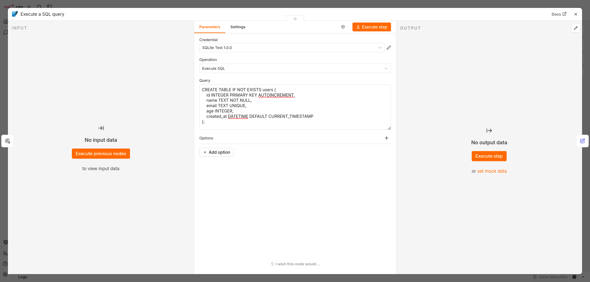
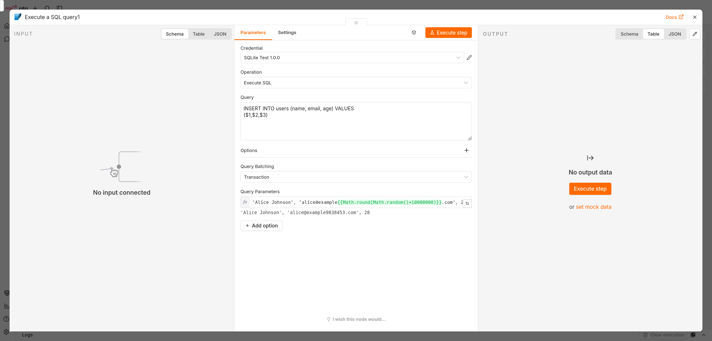
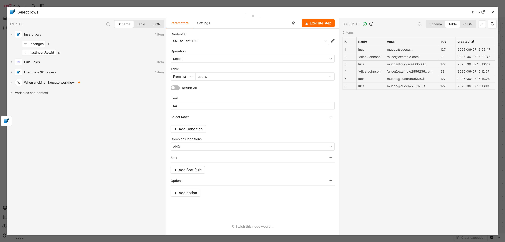
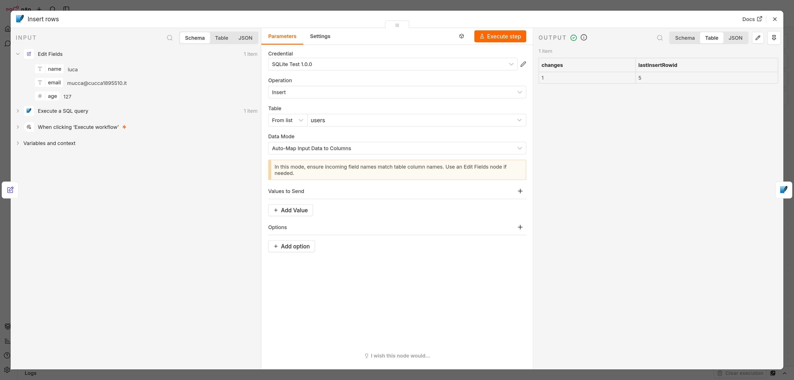
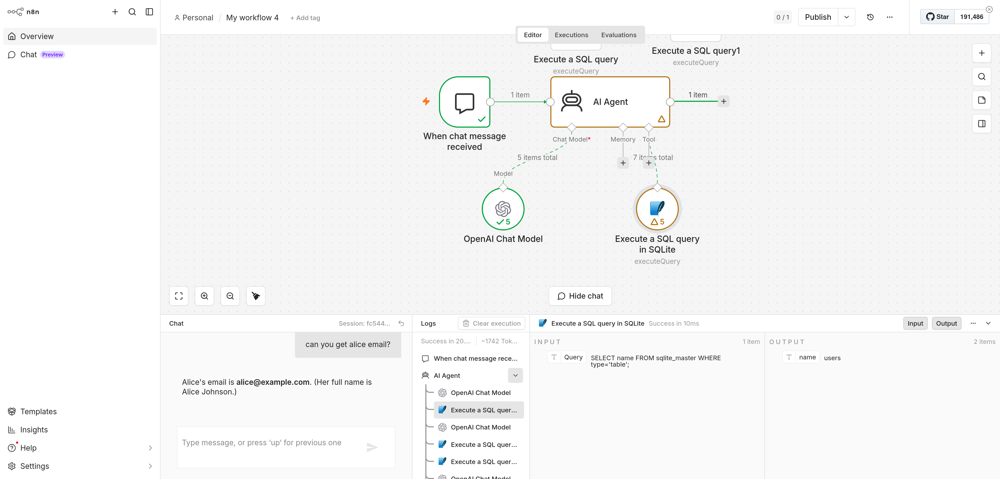
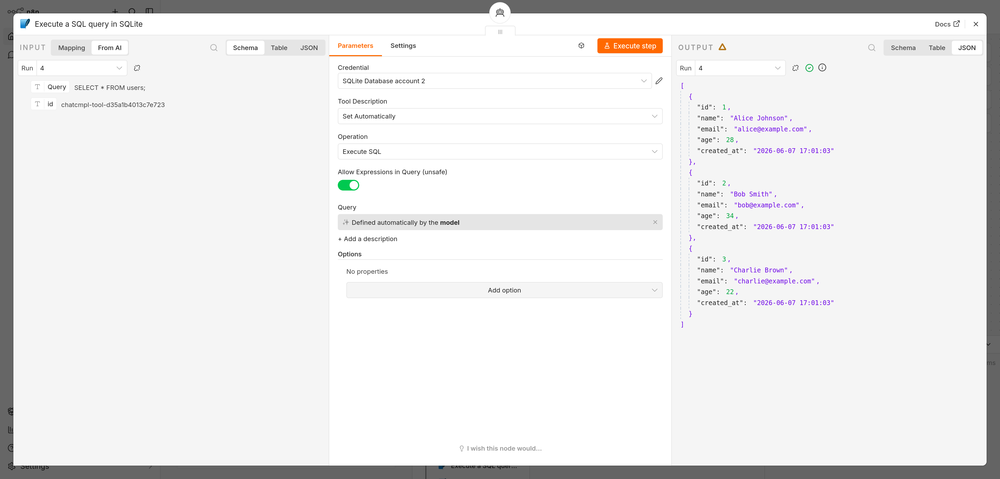

# n8n-nodes-sqlite3

This is an n8n community node. It lets you use SQLite3 in your n8n workflows.

SQLite3 is a lightweight, self-contained SQL database engine that stores all data in a single file and requires no server setup. It is ideal for embedded applications, local storage, and small to medium-sized projects.

[n8n](https://n8n.io/) is a [fair-code licensed](https://docs.n8n.io/reference/license/) workflow automation platform.

## Installation

Follow the [installation guide](https://docs.n8n.io/integrations/community-nodes/installation/) in the n8n community nodes documentation.

For local development:

```bash
npm run build
npm link
cd ~/.n8n/nodes
npm link n8n-nodes-sqlite3
```

## Credentials

The node uses a **SQLite Database** credential to store the database path. Set it to an absolute path to your SQLite file:

```
/home/user/data/mydb.sqlite
```

The directory is created automatically if it does not exist. The file is created on first write if it does not exist.



## Operations

All operations are available under the **Database** resource.

| Operation | Description |
|-----------|-------------|
| **Select** | Query rows from a table with optional WHERE filters, column selection, and sort |
| **Insert** | Insert one or more rows into a table |
| **Update** | Update rows matching a column value |
| **Delete** | Delete rows matching a column value, or drop a table |
| **Create or Update** | Insert or replace rows based on a conflict key (upsert) |
| **Execute SQL** | Run arbitrary SQL, including DDL and multi-statement scripts |

## Execute SQL

Use this operation for DDL statements (`CREATE TABLE`, `DROP`, `ALTER`) or any SQL not covered by the structured operations. Multiple statements separated by `;` are all executed in a single call.

```sql
CREATE TABLE IF NOT EXISTS users (
    id         INTEGER PRIMARY KEY AUTOINCREMENT,
    name       TEXT NOT NULL,
    email      TEXT UNIQUE,
    age        INTEGER,
    created_at DATETIME DEFAULT CURRENT_TIMESTAMP
);
```



### Parameterized queries

Use positional placeholders `$1`, `$2`, `$3`, … in the SQL and provide the corresponding values as a comma-separated string in **Options → Query Parameters**. Placeholders are replaced in order.

```sql
INSERT INTO users (name, email, age) VALUES ($1, $2, $3)
```

Query Parameters: `Alice Johnson, alice@example.com, 28`

n8n expressions are supported in the Query Parameters field, so you can inject dynamic values from upstream nodes without touching the query string itself.



### Allow Expressions in Query (unsafe)

By default, n8n expressions are **not** evaluated inside the SQL query field. This prevents expression-based SQL injection when user-controlled data flows through the workflow.

If you need to build the query dynamically using expressions (e.g., `SELECT * FROM {{ $json.tableName }}`), enable the **Allow Expressions in Query (unsafe)** toggle. Only do this when all data feeding into the query is trusted. Passing unsanitized user input into the query string can lead to SQL injection.

## Select

Query rows from a table with optional WHERE conditions, column selection, sort rules, and a row limit.



## Insert

Insert rows into a table. In **Auto-Map Input Data to Columns** mode, field names from the upstream node are matched to column names automatically, with no manual mapping needed.



## Using as an AI Agent Tool

The node is marked as `usableAsTool`, which means it can be connected directly to an AI Agent node as a tool. The agent decides when to query the database and constructs the parameters autonomously.

Each operation can be used as a separate tool. **Execute SQL** is the most flexible: the agent writes the full query. The structured operations (Select, Insert, Update, etc.) are useful when you want to limit what the agent can do: a tool wired to Select cannot accidentally delete data.



When the agent calls the Execute SQL tool, it fills in the query autonomously. Enable **Allow Expressions in Query (unsafe)** if you want the agent's query to be evaluated as an n8n expression rather than sent verbatim to SQLite.



## Compatibility

Requires n8n with community node support, and Node 22 or newer.

Since v13 `better-sqlite3` is an [N-API](https://nodejs.org/api/n-api.html) addon: it ships a
prebuilt binding for every supported platform inside its own npm package, and those binaries
are **not tied to the Node ABI**. The same file keeps working when n8n bumps its Node version,
so nothing has to be rebuilt for each n8n release. The node works out of the box both inside
the n8n Docker image (Alpine/musl) and on a plain Node installation (glibc, macOS, Windows).

The binding is resolved at runtime, in this order:

1. `N8N_SQLITE3_NATIVE_BINDING`, if set, pointing at a `better_sqlite3.node` file.
2. The binding `better-sqlite3` ships — the normal case, always version-matched to the library.
3. A binding bundled with this package under `native/<platform>-<libc>-<arch>/`, as a fallback
   for installations where the one above cannot be loaded.

The SQLite node (v1) also exposes **Use Custom Bindings** and **Use Default Bindings** options
if you want to decide per node.

## Bundling a binding

`native/` ships musl builds for the n8n Docker image. To refresh them after upgrading
`better-sqlite3`, or to bundle more platforms:

```bash
npm run prebuilds                 # musl x64 + arm64 (the n8n Docker image)
npm run prebuilds -- --all        # every platform better-sqlite3 ships
npm run prebuilds -- --clean      # drop bundled bindings that are no longer selected
```

This copies the binaries out of `node_modules/better-sqlite3/prebuilds` — no compiler and no
network access involved.

## Building a binding from source

Only needed for a platform `better-sqlite3` publishes no prebuild for:

```bash
docker build -t better-sqlite3-builder .
docker run --rm -v "$PWD/native:/output" better-sqlite3-builder
```

The binding is written to `native/<platform>-<libc>-<arch>/better_sqlite3.node`, where the node
picks it up automatically. Edit the base image in the `Dockerfile` to target a different platform.

## Resources

- [n8n Community Nodes documentation](https://docs.n8n.io/integrations/community-nodes/)
- [SQLite documentation](https://www.sqlite.org/docs.html)
- [better-sqlite3](https://github.com/WiseLibs/better-sqlite3)

## Contributing

Contributions are welcome. Open an issue or pull request on GitHub.
